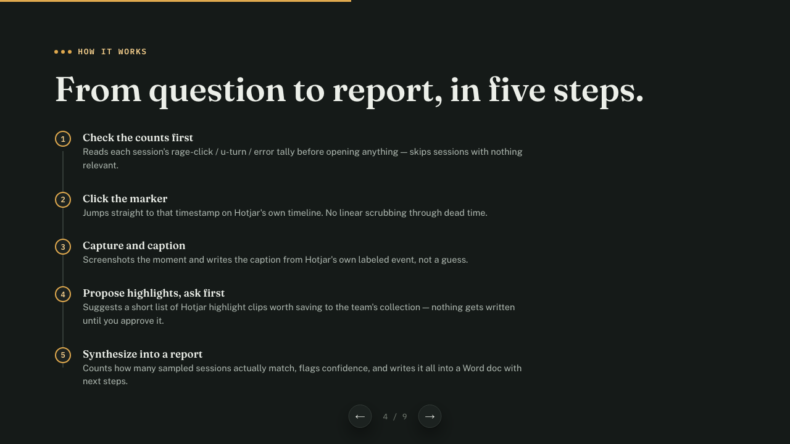

# Hotjar Pattern Finder (Claude Code skill)

**[📖 Visual guide — how it works in 9 slides](https://jaytran-prog.github.io/Hotjar-pattern-finder/)** · [Install](#install) · [Try it](#try-it) · [Privacy](#data--privacy--please-read)

Ask a UX research question in plain language — *"do users hesitate before paying?"* or *"why do people drop off at signup step 2?"* — and Claude samples several real Hotjar recordings in your own Chrome, counts how many show the behaviour, and gives you:

- **A Word (.docx) report**: key finding with a count ("8 of 10 sessions…") and confidence level, a hero screenshot, a per-session table, evidence with cropped screenshots, next steps.
- **Hotjar highlight clips** (optional, only after you approve them) with a consistent insight comment, filed in the collection that matches the segment you sampled.

It works on **any website or app you record with Hotjar**: it reads Hotjar's own UI, not your site's, so nothing in it is tied to one product. There's no Hotjar API behind this. Claude drives the Hotjar web UI in the Chrome you're already logged into, and it never handles your Hotjar password.

## Visual guide

A 9-slide walkthrough of what it does, how it works, the guardrails, and how to set it up:

**→ [Open the guide](https://jaytran-prog.github.io/Hotjar-pattern-finder/)** (or open [`docs/index.html`](docs/index.html) locally in a browser). Use ← → or click to move between slides. `#8` in the URL jumps straight to setup.

[](https://jaytran-prog.github.io/Hotjar-pattern-finder/)

---

## Requirements

| What | Why | How to check |
|---|---|---|
| **Claude Code** (desktop app or CLI) | Runs the skill | — |
| **Claude in Chrome** extension, connected to Claude Code | Drives your real, logged-in Chrome | In Claude Code, ask "list my Chrome tabs" |
| **Logged into Hotjar** in that Chrome | The skill reuses your session | Open insights.hotjar.com |
| **Python 3 + Pillow** | Saves and crops screenshots | `bash …/scripts/check_setup.sh` |
| **Node 18+** | Builds the Word report | same |
| *(optional)* LibreOffice + Poppler | Visual check of the rendered report | same |

It won't work in claude.ai chat or the built-in browser pane, because neither has your Hotjar login.

## Install

**Option A — plugin (recommended, easy updates).** In Claude Code:

```
/plugin marketplace add jaytran-prog/Hotjar-pattern-finder
/plugin install hotjar-pattern-finder@hotjar-pattern-finder
```

Restart Claude Code if the skill doesn't show up. To update later: `/plugin marketplace update hotjar-pattern-finder`.

**Option B — plain skill folder.**

```bash
git clone https://github.com/jaytran-prog/Hotjar-pattern-finder.git
```

```bash
cp -R Hotjar-pattern-finder/plugins/hotjar-pattern-finder/skills/hotjar-pattern-finder ~/.claude/skills/
```

**Then, once per machine** (Claude also runs this itself on first use):

```bash
bash ~/.claude/skills/hotjar-pattern-finder/scripts/check_setup.sh
```

For a plugin install, the folder is inside `~/.claude/plugins/`. Easiest is to ask Claude to "run the hotjar-pattern-finder setup check". The script installs the one npm package it needs (`docx`) and tells you exactly what else is missing.

## Try it

1. In Hotjar, make sure there's a **saved segment** for what you want to study (e.g. "Checkout"). The skill doesn't build filters.
2. In Claude Code, run `/hotjar-pattern-finder` (for a plugin install, it may appear as `/hotjar-pattern-finder:hotjar-pattern-finder`), or just ask: *"Check Hotjar: in the Checkout segment, do users hesitate before clicking Pay?"*
3. Answer the short setup questions (goal, question, segment, sample size — default 5).
4. Claude reviews the recordings, then **shows you the highlights it proposes and waits for your OK** before writing anything to Hotjar.
5. You get the `.docx` in `docs/hotjar-findings/` of the folder you ran Claude in.

To test just the report builder without Hotjar (after `check_setup.sh`):

```bash
node plugins/hotjar-pattern-finder/skills/hotjar-pattern-finder/scripts/build_report.js examples/example.report.json example.docx
```

## Cost

About **140–170k tokens of context per question** with the default sample of 5, roughly **12–18% of a Pro plan's 5-hour limit**. Much of that is fixed overhead from tool definitions. Running in a session with unused MCP connectors turned off makes it cheaper.

## Data & privacy — please read

- Recordings contain **real user data**. Reports and screenshots are saved **only on your machine**, and Claude asks before sharing anything.
- **Never commit research output.** This repo's `.gitignore` excludes `docs/hotjar-findings/`, `*.docx` and screenshots. Keep it that way.
- Highlights are created **under your Hotjar name**, visible to your team, only after you approve them, and never with @mentions, user IDs or personal names.
- If Claude Code's auto mode blocks a Hotjar write, that's expected. Approve it or click Save yourself.

## What's inside

```
.claude-plugin/marketplace.json            marketplace entry (lets /plugin install find it)
plugins/hotjar-pattern-finder/
  .claude-plugin/plugin.json
  skills/hotjar-pattern-finder/
    SKILL.md                               the instructions Claude follows (8 steps + token budget)
    report-template.md                     report JSON spec format
    docs/design.md                         why it's built this way
    scripts/
      check_setup.sh                       prerequisite check + npm install
      hotjar_actions.js                    one-call recording journey extractor (runs in the page)
      hotjar_info.js                       Info-tab counts without PII (runs in the page)
      shot_receiver.py                     localhost-only receiver that saves screenshots to disk
      crop_player.py                       crops screenshots to the replayed page
      build_report.js                      JSON spec -> .docx
examples/                                  fictional example report spec + placeholder image
docs/index.html                            visual slide guide (served by GitHub Pages)
```

## Troubleshooting

| Symptom | Fix |
|---|---|
| "You're not logged into Hotjar" | Log in to Hotjar in the Chrome that Claude in Chrome controls, then say "continue". |
| Replay stays thumbnail-sized | Expected. The skill closes the side panels and triggers a resize. If it persists, widen the Chrome window. |
| `hotjar_actions.js` returns "actions list not found" | Hotjar changed its UI. The fallback steps and selectors are in SKILL.md → Step 4. |
| Report build fails with `Cannot find module 'docx'` | Run `check_setup.sh` again. |
| Highlight save blocked | Claude Code auto mode treats Hotjar writes as external. Approve, or save manually. |

Feedback and fixes welcome. Open an issue or PR.
